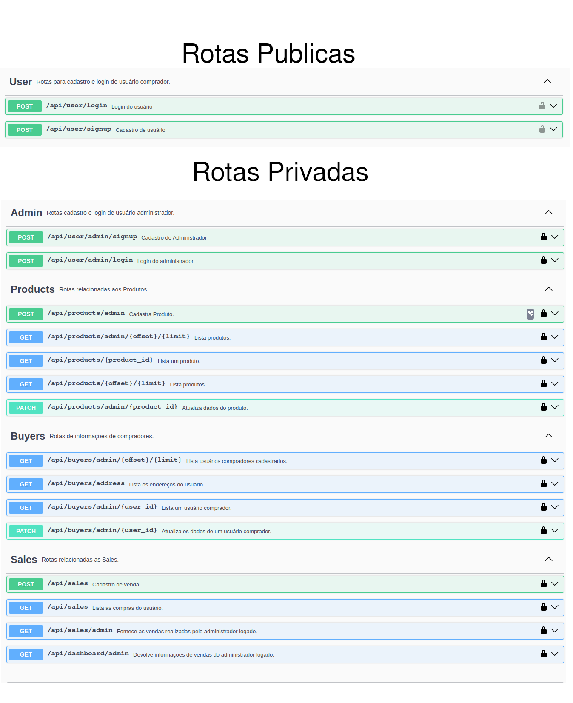

<p align="center">
    
</p>

<h1 align="center">Express Pharmacy - Back End</h1>

Express Pharmacy System é uma aplicação Back-End construída durante o terceiro módulo do **Curso Full Stack**, organizado pelo [SESI/SENAI](https://cursos.sesisenai.org.br/ "Site do SESI/SENAI"), [LAB365](https://lab365.tech/ "Site do LAB365") e [floripamaistec](https://floripamaistec.pmf.sc.gov.br/ "Site do floripamaistec"). Ele tem como objetivo a elaboração de um sistema de Marketplace para venda de produtos do setor farmacêutico, utilizando **Node.Js**, **Express** e **Sequelize** juntamente com uma estrutura **MVC**.


## 🛠️ Tecnologias Utilizadas

Para a construção desse projeto, utilizamos as seguintes tecnologias:

* [bcrypt](https://www.npmjs.com/package/bcrypt) - Biblioteca que auxilia na encriptação de senhas.
* [cors](https://www.npmjs.com/package/cors) - Pacote que funciona como um middleware que auxilia nas conexões da API.
* [dotenv](https://www.npmjs.com/package/dotenv) - Módulo que auxilia na configuração das variáveis de ambiente.
* [express](https://expressjs.com/pt-br/) - Framework web rápido, flexível e minimalista para Node.js
* [jest](https://jestjs.io/pt-BR/) - Framework de testes em JavaScript.
* [jasonwebtoken](https://jwt.io/) - Utilizado para transmitir informações de forma segura em validações e login.
* [postgresql](https://www.postgresql.org/) - Banco de Dados open source.
* [sequelize](https://sequelize.org/) - Moderno ORM que dá suporte para transações e relações com o Banco de Dados.
* [swagger](https://swagger.io/) - Simplifica os teste de API, criando uma página no navegador de fácil manuseio.

## 🔧 Como executar o projeto
```bash
# clonar repositório
git clone https://github.com/FullStack-Itaguacu/M3P-BackEnd-Squad1.git

# entrar na pasta do projeto
cd M3P-BackEnd-Squad1

# instalar dependências
npm install / npm i

# configurar variáveis de ambiente através do arquivo .env tendo como base o arquivo .env_example:
PORT = 3333
HOST = localhost
DB_DIALECT = postgres
DB_HOST = localhost
DB_PORT = 15432
DB_USERNAME = postgres
DB_PASSWORD = password
DB_DATABASE = db_name3333
NODE_ENV = development || production || test
JWT_KEY = secretForJWT

# executar o projeto
npm run dev

# utilizar a interface do swagger para realizar os testes nos endpoints:
http://localhost:3000/api-docs
```

<hr>
<br>

Essa é a interface do SwaggerUI, basta preencher os campos conforme requisitado nos endpoints e realizar os testes das rotas. Lembre-se de colocar o token gerado no login para ter acesso as rotas privadas.

<!--   -->


## ✒️ Autores

Esse projeto foi desenvolvido por:

* **Luis Federico Vilar Velazquez** - [GitHub](https://github.com/Luis-Vilar) | [LinkedIn](https://www.linkedin.com/in/luis-vilar/)
* **Willyan G Gutierres Gonçalves** - [GitHub](https://github.com/wgeovanni) | [LinkedIn](https://www.linkedin.com/in/willyan-geovanni/)
* **Adriano Jose Volter** - [GitHub](https://github.com/AdrianoVolter) | [LinkedIn](https://www.linkedin.com/in/adrianovolter/)
* **Filipe Bratti Schmidt** - [GitHub](https://github.com/filipebratti) | [LinkedIn](https://www.linkedin.com/in/filipe-bratti-schmidt-408a925b/)


Você também pode ver a lista de todos os desenvolvedores que participaram desse projeto no [Repositório do Projeto no GitHub.](https://github.com/FullStack-Itaguacu/M3P-BackEnd-Squad1)

## 🎁 Agradecimentos

* Gostaríamos de agradecer a toda equipe do [SESI/SENAI](https://cursos.sesisenai.org.br/ "Site do SESI/SENAI"), [LAB365](https://lab365.tech/ "Site do LAB365") e [FLORIPAMAISTEC](https://floripamaistec.pmf.sc.gov.br/ "Site do floripamaistec") por todo suporte nesses nove meses do curso Full Stack. Com toda certeza sairemos desse ciclo com um grande conhecimento adquirido e melhor preparados para o mercado de trabalho na área da Tecnologia.
* Um agradecimento especial a cada professor que passou por nossa turma e que contribuiu para nossa evolução pessoal e profissional, com toda paciência e dedicação que tiveram em sanar nossos problemas e dúvidas.


---
